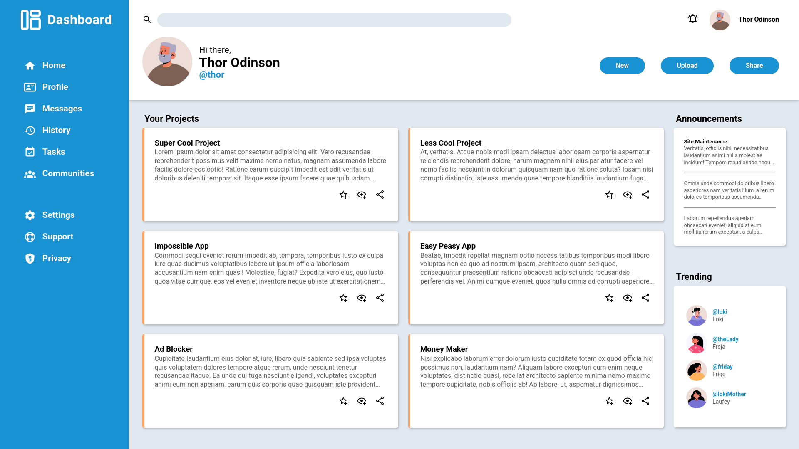

**README.md**

---

# Dashboard

A simple dashboard page created as part of The Odin Project course. This project demonstrates the use of CSS Grid for layout design. Currently, the dashboard is not adaptive and is intended for desktop viewing.

## Features

- **Header**: Includes a search bar, profile information, and navigation buttons.
- **Aside Navigation**: A sidebar with links to different sections of the dashboard.
- **Main Content**:
  - **Projects**: Displays a list of projects with brief descriptions and action icons.
  - **Announcements**: Shows recent site maintenance updates and other important notices.
  - **Trending**: Highlights trending profiles with avatars, usernames, and names.

## Technologies Used

- HTML
- CSS

## Live Demo

You can view the live version of the dashboard at: [Live Demo](https://aleksey-kerkin.github.io/odin-admin-dashboard/)

## Screenshots

## Usage

- **Navigation**: Use the links in the aside navigation to explore different sections (though currently, they are placeholders).
- **Profile**: View your profile information in the header.
- **Projects**: Read summaries of your projects and use the action icons to favorite, view, or share them.
- **Announcements**: Stay updated with the latest site news.
- **Trending**: Check out trending profiles and their details.

## Contributing

This project is a personal exercise and may not be open for contributions. However, feel free to fork and modify it for your own purposes.

## License

MIT License

## Acknowledgments

- Special thanks to [The Odin Project](https://www.theodinproject.com) for the curriculum and resources.
- Icons provided by [Pictogrammers](https://pictogrammers.com) for Material Design icons.
- Avatar placeholders courtesy of [Avatar Placeholder](https://avatar-placeholder.iran.liara.run/).

## Lessons Learned

- Gained proficiency in using CSS Grid for layout design.
- Learned about the limitations of static layouts and the importance of responsiveness.

## Future Enhancements

- Plan to make the dashboard adaptive and responsive for different screen sizes.
- Add interactivity and dynamic content in future iterations.
